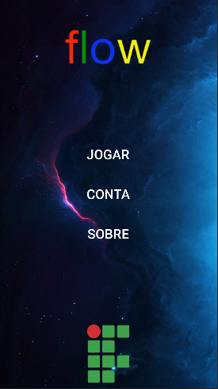
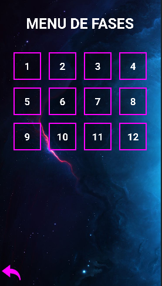
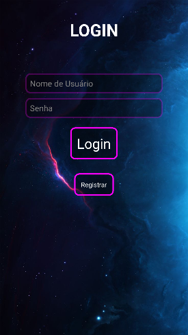
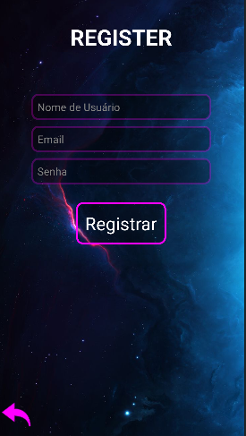
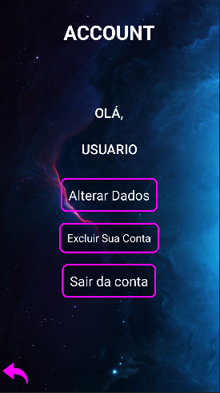
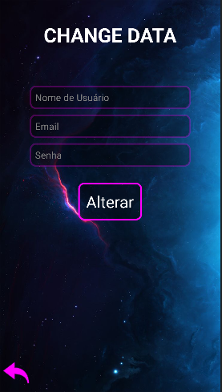
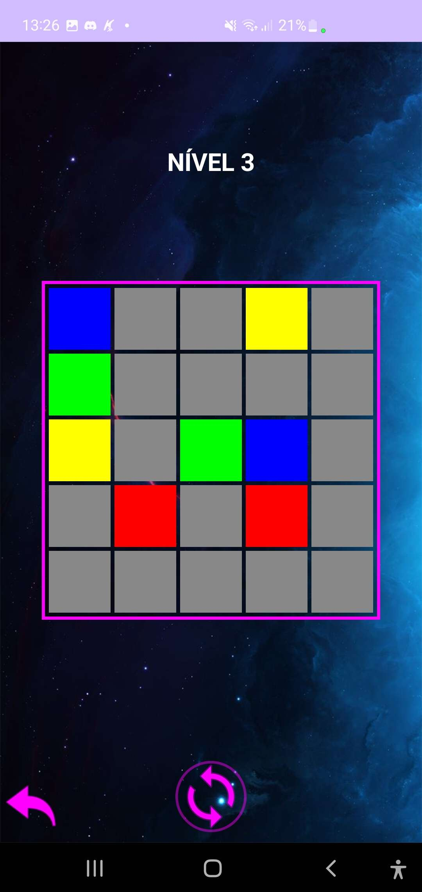
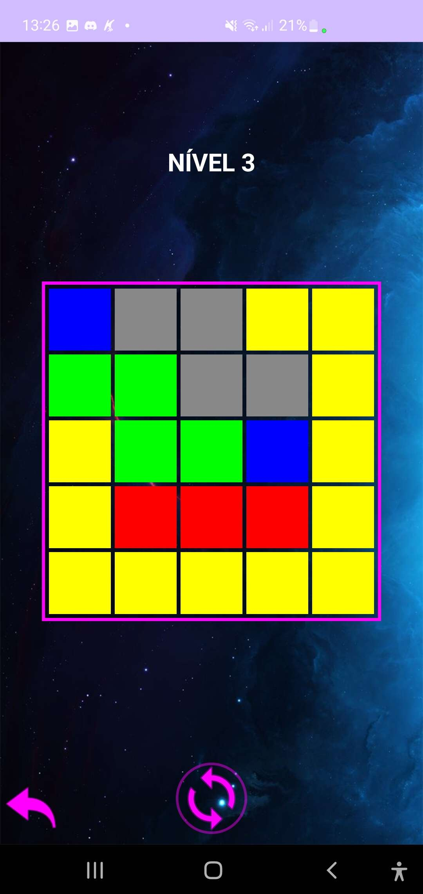
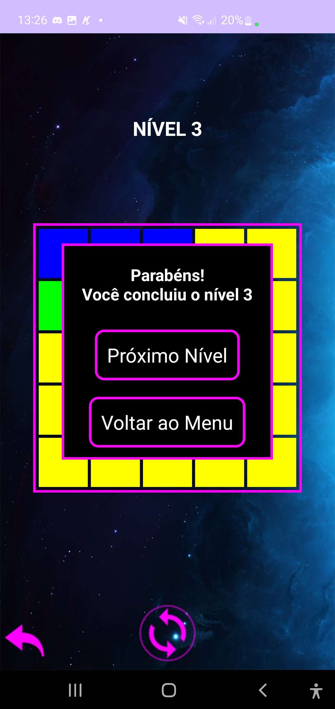

<h1 align="center">Flow-Free-Copy</h1>

## 📖 About the project
This project was inspired by the game Flow Free from Duck Duck Games, but not only that, it is also part of the extension project for the 4th semester of ADS (Analysis and Systems Development) at IFTM-CAUPT, which will be presented at IFEX. <br>
The student developers of the application used Kotlin as the development language, and the Android Studio as the IDE.

#### How does the game work?

Flow is a game that involves connecting colored dots on a board, filling the entire board without allowing the lines to cross.

### App Screens

|  |  |  |
|:---:|:---:|:---:|
| **Menu** | **Play Menu** | **Login** |

|  |  |  |
|:---:|:---:|:---:|
| **Register** | **Account** | **Alter Account** |

### Game Screen

|  |  |  |
|:---:|:---:|:---:|
| **Initial Level** | **Solving Level** | **Level Completed** |

## 🦾 Technologies used
<div style="display: flex;">
 


</div>

## 🤔 What we learned
- We gained a deeper understanding of back-end and mobile programming logic.
- We enhanced our knowledge in app design with XML.
- We deepened our logic in building mobile games.
- We learned more about manipulating SQLite in mobile game applications.

## 🧑‍🎓 Authors
- <a href="https://github.com/DevGustavus"> Gustavo Machado Pontes - DevGustavus </a>
- <a href="https://github.com/c-Alvinn"> Álvaro Ríquel Dias - c-Alvinn </a>

## 👽 How to clone this project

````bash
    # Select where you want to clone
    $ cd ~/Documents/WHERE_YOU_WANT
````

````bash
    # Clone the project
    $ git clone https://github.com/c-Alvinn/Flow-Free-Copy.git
````

````bash
    # Check if cloning worked fine
    $ cd ~/Documents/DIRECTORY_LOCATION
    $ ls
````
